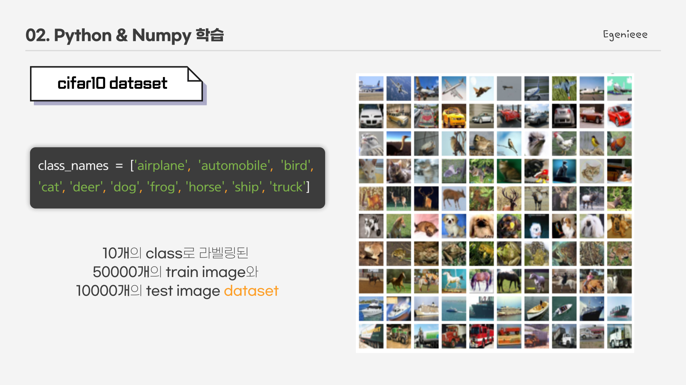
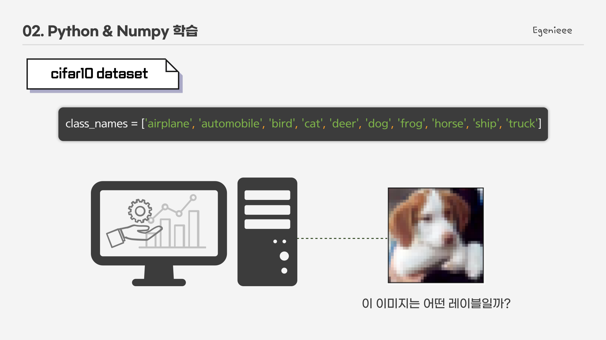
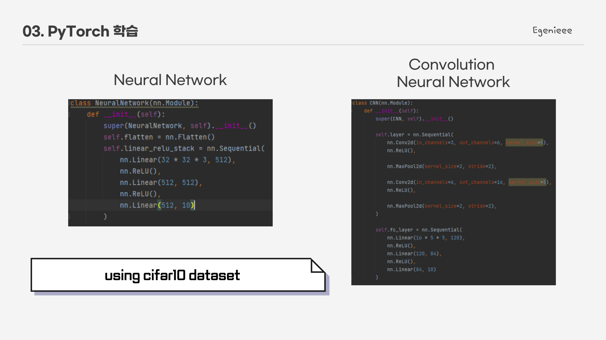
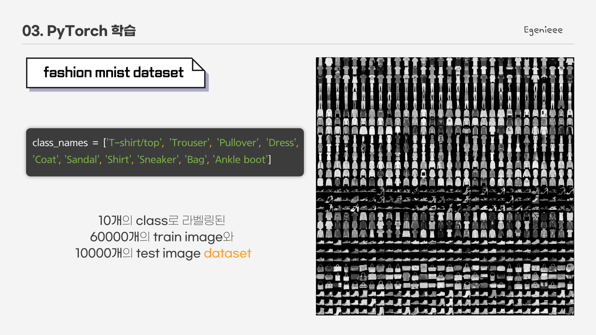
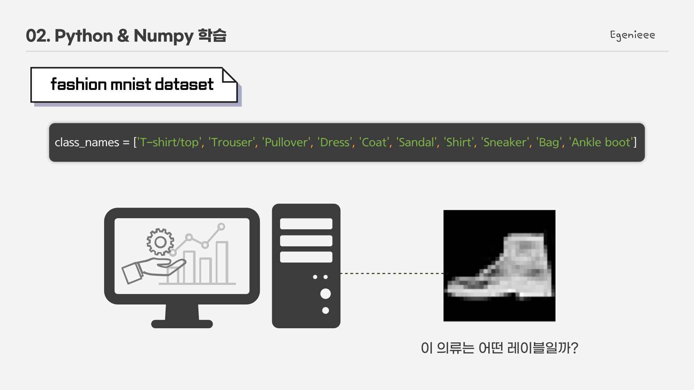
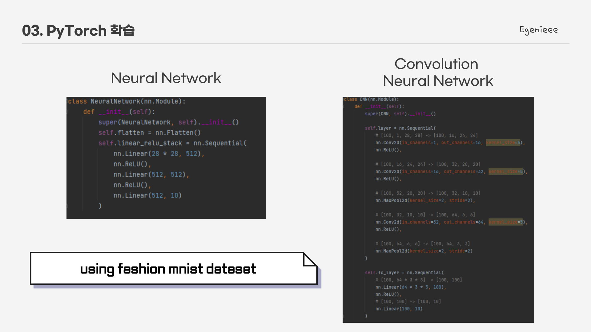

# PyTorch_Practice
### Deep Learning Framework PyTorch 실습

* Neural Network
  * cifar10 dataset
  * fashion mnist dataset
* Convolution Neural Network
  * cifar10 dataset
  * fashion mnist dataset
* TensorBoard Tutorial

## Using Cifar10 dataset
#### - cifar10 dataset

#### - model task

모델은 테스트 이미지가 들어왔을 때 어떤 이미지(레이블)인지 예측해야 한다.

#### - model define

* 구현 file
> cnn_cifar10.py   
> nn_cifar10.py

## Using Fashion mnist dataset
#### - fashion mnist dataset

#### - model task

모델은 테스트 이미지가 들어왔을 때 어떤 이미지(레이블)인지 예측해야 한다.

#### - model define

* 구현 file
> cnn_fashion_mnist.py   
> nn_fashion_mnist.py